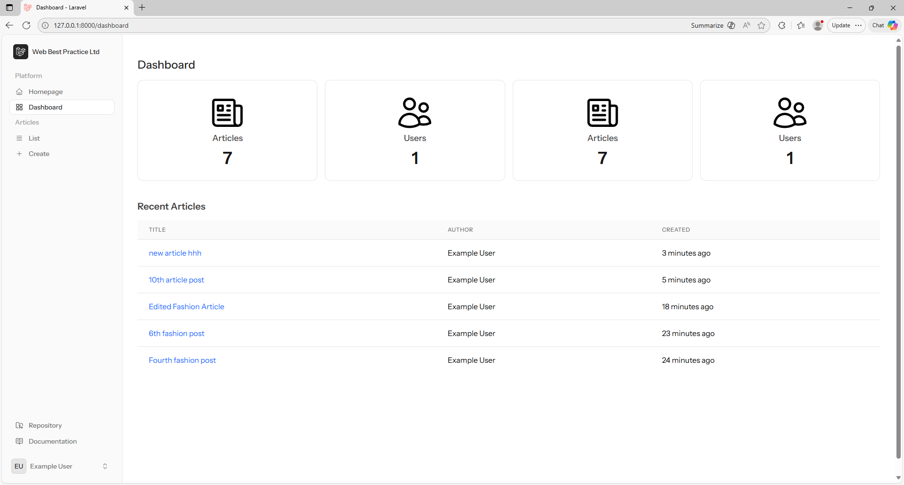
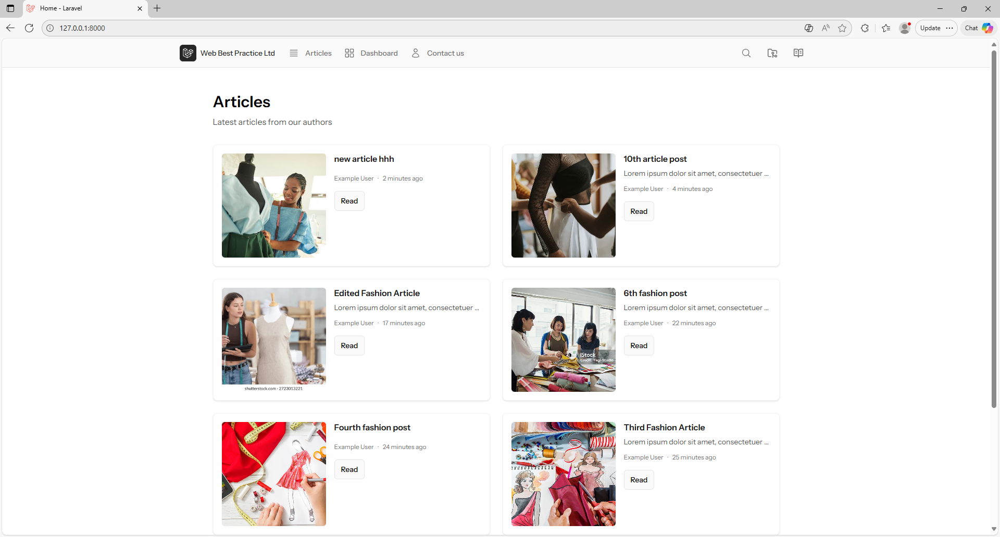
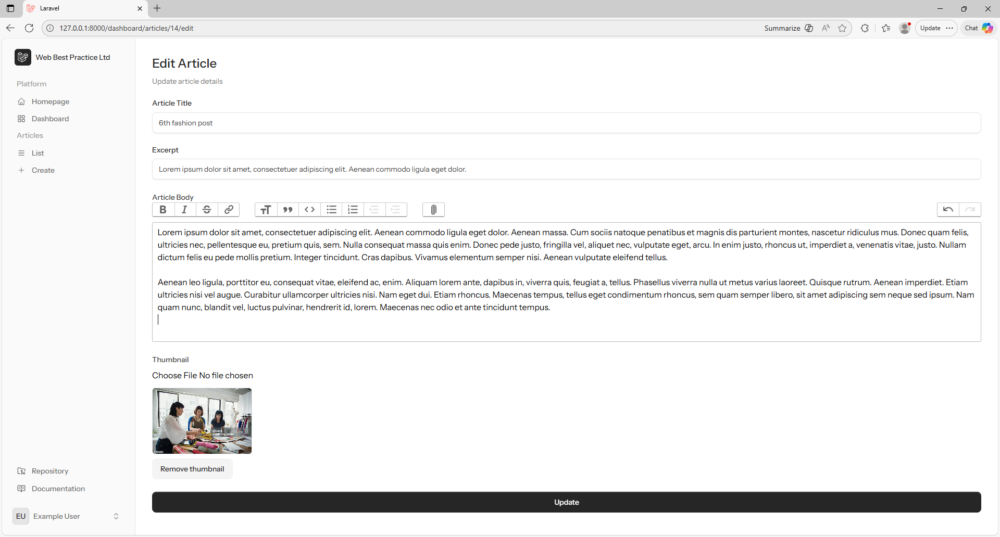
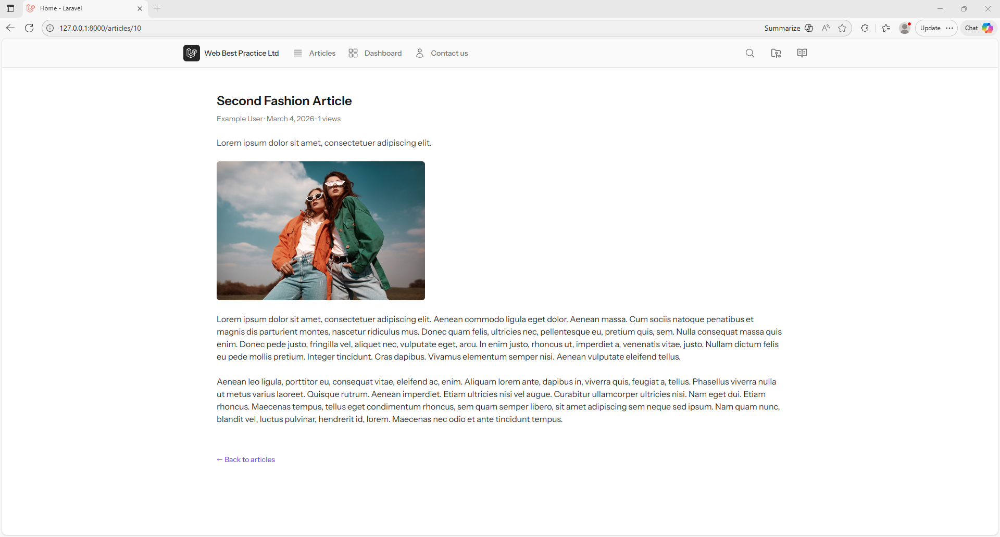
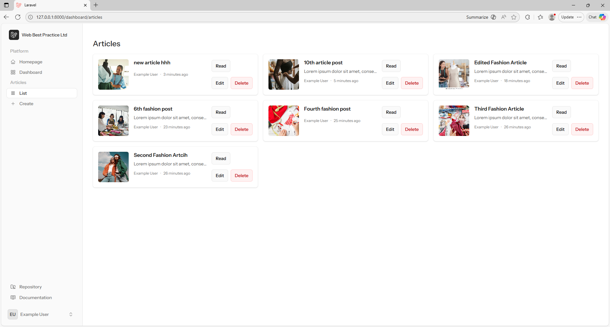
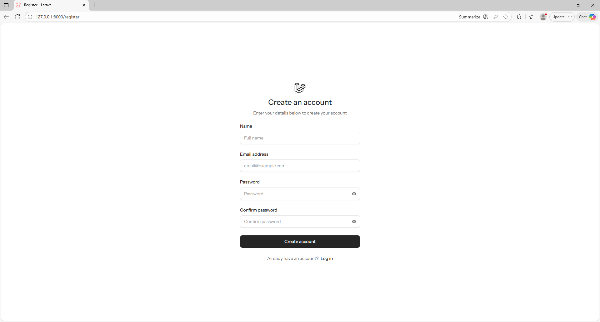

# Simpo Mag

Simpo Mag is a Laravel based simple magazine for demonstartion of simple blog system with blogs homepage and dashboard for articles management. It laravel framework based system done with livewire.

## Demo

You can see under demo folder








### Watch The Video
https://youtu.be/seXyiQxR55o

[](https://youtu.be/seXyiQxR55o?si=5ZGcfAKyIeTV8wJm)


## Installation

Download or clone the repo [github](https://github.com/jotelij/simpo-mag) to install Simpo Mag.

```bash
git clone https://github.com/jotelij/simpo-mag
```

build the project first
```bash
composer install
```

create .env file
```bash
# linux
cp .env.exmaple .env

#windows
copy .env.exmaple .env
```

generate Application key

```bash
php artisan key:generate
```

migrate the db
```bash
php artisan migrate
```

link the storage

```bash
php artisan storage:link
```

then
```bash
npm install

# for dev
npm run dev

# or for production
npm run buld
```

## Usage

```bash
php artisan serve
```

## Contributing

Pull requests are welcome. For major changes, please open an issue first
to discuss what you would like to change.


## License

[MIT](https://choosealicense.com/licenses/mit/)